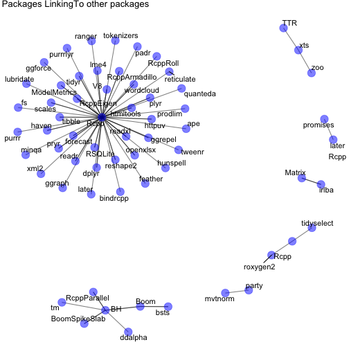

```r
library(tidyverse)
library(stringr)
library(igraph)
library(ggraph)

# Tibble of installed packages
inst_packages <- installed.packages() %>% as_tibble()

# Take a look at what we've got in LinkingTo; seems like a comma separated string
inst_packages$LinkingTo[1:50]
```

```
##  [1] NA                                NA                               
##  [3] NA                                NA                               
##  [5] NA                                "Rcpp"                           
##  [7] NA                                NA                               
##  [9] NA                                NA                               
## [11] NA                                NA                               
## [13] NA                                NA                               
## [15] NA                                NA                               
## [17] NA                                NA                               
## [19] NA                                NA                               
## [21] NA                                NA                               
## [23] NA                                NA                               
## [25] NA                                NA                               
## [27] NA                                NA                               
## [29] NA                                NA                               
## [31] NA                                "Rcpp, plogr"                    
## [33] NA                                NA                               
## [35] NA                                NA                               
## [37] "BH (>= 1.15.0-2)"                "BH (>= 1.15.0-2)"               
## [39] NA                                NA                               
## [41] NA                                "Boom (>= 0.7), BH (>= 1.15.0-2)"
## [43] NA                                NA                               
## [45] NA                                NA                               
## [47] NA                                NA                               
## [49] NA                                NA
```

```r
# For now, take just the first link and remove trailing commas
inst_packages <- inst_packages %>%
  mutate(
    linking_to = str_split(LinkingTo, " ") %>% map_chr(first) %>% gsub(",", "", .)
)

# Create the links between packages and their first LinkingTo package
package_links <- inst_packages %>%
  drop_na(linking_to) %>%
  select(Package, linking_to) %>%
  as_tibble() %>%
  igraph::graph_from_data_frame()

# Make the graph!
link_graph <- ggraph::ggraph(package_links, layout = "fr") +
  geom_edge_link(alpha = 0.5) +
  geom_node_point(color = "blue", size = 5, alpha = 0.5) +
  geom_node_text(aes(label = name), repel = TRUE) +
  theme_void() +
  ggtitle("Packages LinkingTo other packages")

link_graph
```



