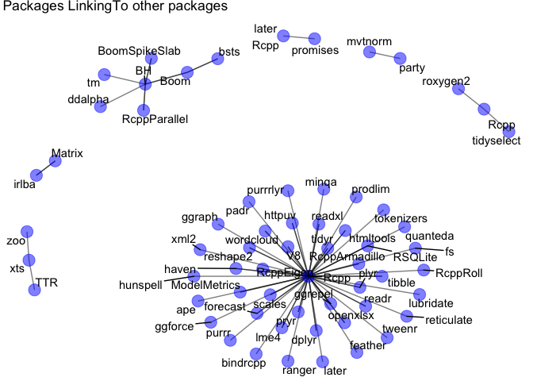

package\_links.R
================
amanda
Wed Jan 31 14:27:26 2018

``` r
# foobar

library(tidyverse)
```

    ## Loading tidyverse: ggplot2
    ## Loading tidyverse: tibble
    ## Loading tidyverse: tidyr
    ## Loading tidyverse: readr
    ## Loading tidyverse: purrr
    ## Loading tidyverse: dplyr

    ## Conflicts with tidy packages ----------------------------------------------

    ## filter(): dplyr, stats
    ## lag():    dplyr, stats

``` r
library(stringr)
library(igraph)
```

    ## 
    ## Attaching package: 'igraph'

    ## The following objects are masked from 'package:dplyr':
    ## 
    ##     as_data_frame, groups, union

    ## The following objects are masked from 'package:purrr':
    ## 
    ##     compose, simplify

    ## The following object is masked from 'package:tidyr':
    ## 
    ##     crossing

    ## The following object is masked from 'package:tibble':
    ## 
    ##     as_data_frame

    ## The following objects are masked from 'package:stats':
    ## 
    ##     decompose, spectrum

    ## The following object is masked from 'package:base':
    ## 
    ##     union

``` r
library(ggraph)

# Tibble of installed packages
inst_packages <- installed.packages() %>% as_tibble()

# Take a look at what we've got in LinkingTo; seems like a comma separated string
inst_packages$LinkingTo[1:50]
```

    ##  [1] NA                                NA                               
    ##  [3] NA                                NA                               
    ##  [5] NA                                "Rcpp"                           
    ##  [7] NA                                NA                               
    ##  [9] NA                                NA                               
    ## [11] NA                                NA                               
    ## [13] NA                                NA                               
    ## [15] NA                                NA                               
    ## [17] NA                                NA                               
    ## [19] NA                                NA                               
    ## [21] NA                                NA                               
    ## [23] NA                                NA                               
    ## [25] NA                                NA                               
    ## [27] NA                                NA                               
    ## [29] NA                                NA                               
    ## [31] NA                                "Rcpp, plogr"                    
    ## [33] NA                                NA                               
    ## [35] NA                                NA                               
    ## [37] "BH (>= 1.15.0-2)"                "BH (>= 1.15.0-2)"               
    ## [39] NA                                NA                               
    ## [41] NA                                "Boom (>= 0.7), BH (>= 1.15.0-2)"
    ## [43] NA                                NA                               
    ## [45] NA                                NA                               
    ## [47] NA                                NA                               
    ## [49] NA                                NA

``` r
# For now, take just the first link and remove trailing commas
inst_packages <- inst_packages %>%
  mutate(
    linking_to = str_split(LinkingTo, " ") %>% map_chr(first) %>% gsub(",", "", .)
)

# Create the links between packages and their first LinkingTo package
package_links <- inst_packages %>%
  drop_na(linking_to) %>%
  select(Package, linking_to) %>%
  as_tibble() %>%
  igraph::graph_from_data_frame()

# Make the graph!
link_graph <- ggraph::ggraph(package_links, layout = "fr") +
  geom_edge_link(alpha = 0.5) +
  geom_node_point(color = "blue", size = 5, alpha = 0.5) +
  geom_node_text(aes(label = name), repel = TRUE) +
  theme_void() +
  ggtitle("Packages LinkingTo other packages")

link_graph
```



``` r
devtools::session_info()
```

    ## Warning in as.POSIXlt.POSIXct(Sys.time()): unknown timezone 'zone/tz/2017c.
    ## 1.0/zoneinfo/America/Los_Angeles'

    ## Session info -------------------------------------------------------------

    ##  setting  value                       
    ##  version  R version 3.3.3 (2017-03-06)
    ##  system   x86_64, darwin13.4.0        
    ##  ui       X11                         
    ##  language (EN)                        
    ##  collate  en_US.UTF-8                 
    ##  tz       <NA>                        
    ##  date     2018-01-31

    ## Packages -----------------------------------------------------------------

    ##  package     * version    date       source                               
    ##  assertthat    0.2.0      2017-04-11 CRAN (R 3.3.3)                       
    ##  backports     1.1.1      2017-09-25 CRAN (R 3.3.2)                       
    ##  base        * 3.3.3      2017-03-07 local                                
    ##  bindr         0.1        2016-11-13 CRAN (R 3.3.3)                       
    ##  bindrcpp    * 0.2        2017-06-17 CRAN (R 3.3.3)                       
    ##  broom         0.4.3      2017-11-20 cran (@0.4.3)                        
    ##  cellranger    1.1.0      2016-07-27 CRAN (R 3.3.3)                       
    ##  colorspace    1.3-2      2016-12-14 CRAN (R 3.3.3)                       
    ##  datasets    * 3.3.3      2017-03-07 local                                
    ##  devtools      1.13.3     2017-08-02 CRAN (R 3.3.3)                       
    ##  digest        0.6.13     2017-12-14 cran (@0.6.13)                       
    ##  dplyr       * 0.7.4.9000 2018-01-18 Github (tidyverse/dplyr@f49115b)     
    ##  evaluate      0.10.1     2017-06-24 CRAN (R 3.3.3)                       
    ##  forcats       0.2.0      2017-01-23 CRAN (R 3.3.3)                       
    ##  foreign       0.8-69     2017-06-21 CRAN (R 3.3.3)                       
    ##  ggforce       0.1.1      2016-11-28 CRAN (R 3.3.2)                       
    ##  ggplot2     * 2.2.0      2018-01-18 Github (hadley/ggplot2@0cf7c56)      
    ##  ggraph      * 1.0.0      2017-02-24 CRAN (R 3.3.2)                       
    ##  ggrepel       0.7.0      2017-09-29 CRAN (R 3.3.2)                       
    ##  glue          1.2.0      2017-10-29 CRAN (R 3.3.2)                       
    ##  graphics    * 3.3.3      2017-03-07 local                                
    ##  grDevices   * 3.3.3      2017-03-07 local                                
    ##  grid          3.3.3      2017-03-07 local                                
    ##  gridExtra     2.3        2017-09-09 CRAN (R 3.3.2)                       
    ##  gtable        0.2.0      2016-02-26 CRAN (R 3.3.3)                       
    ##  haven         1.1.0      2017-07-09 CRAN (R 3.3.3)                       
    ##  hms           0.3        2016-11-22 CRAN (R 3.3.3)                       
    ##  htmltools     0.3.6      2017-04-28 CRAN (R 3.3.3)                       
    ##  httr          1.3.1      2017-08-20 cran (@1.3.1)                        
    ##  igraph      * 1.1.2      2017-07-21 CRAN (R 3.3.2)                       
    ##  jsonlite      1.5        2017-06-01 CRAN (R 3.3.3)                       
    ##  knitr         1.18       2017-12-27 cran (@1.18)                         
    ##  labeling      0.3        2014-08-23 CRAN (R 3.3.3)                       
    ##  lattice       0.20-35    2017-03-25 CRAN (R 3.3.3)                       
    ##  lazyeval      0.2.1      2017-10-29 CRAN (R 3.3.2)                       
    ##  lubridate     1.7.1      2017-11-03 cran (@1.7.1)                        
    ##  magrittr      1.5        2014-11-22 CRAN (R 3.3.3)                       
    ##  MASS          7.3-47     2017-04-21 CRAN (R 3.3.3)                       
    ##  memoise       1.1.0      2017-04-21 CRAN (R 3.3.3)                       
    ##  methods     * 3.3.3      2017-03-07 local                                
    ##  mnormt        1.5-5      2016-10-15 CRAN (R 3.3.0)                       
    ##  modelr        0.1.1      2017-07-24 CRAN (R 3.3.3)                       
    ##  munsell       0.4.3      2016-02-13 CRAN (R 3.3.3)                       
    ##  nlme          3.1-131    2017-02-06 CRAN (R 3.3.3)                       
    ##  parallel      3.3.3      2017-03-07 local                                
    ##  pkgconfig     2.0.1      2017-03-21 CRAN (R 3.3.3)                       
    ##  plyr          1.8.4      2016-06-08 CRAN (R 3.3.3)                       
    ##  psych         1.7.8      2017-09-09 CRAN (R 3.3.3)                       
    ##  purrr       * 0.2.4      2017-10-18 CRAN (R 3.3.2)                       
    ##  R6            2.2.2      2017-06-17 CRAN (R 3.3.3)                       
    ##  Rcpp          0.12.14    2017-11-23 cran (@0.12.14)                      
    ##  readr       * 1.1.1      2017-05-16 CRAN (R 3.3.3)                       
    ##  readxl        1.0.0      2017-04-18 CRAN (R 3.3.3)                       
    ##  reshape2      1.4.3      2017-12-11 cran (@1.4.3)                        
    ##  rlang         0.1.6.9003 2018-01-18 Github (tidyverse/rlang@5949741)     
    ##  rmarkdown     1.6        2017-06-15 CRAN (R 3.3.3)                       
    ##  rprojroot     1.2        2017-01-16 CRAN (R 3.3.3)                       
    ##  rvest         0.3.2      2016-06-17 CRAN (R 3.3.0)                       
    ##  scales        0.5.0.9000 2017-11-04 Github (hadley/scales@d767915)       
    ##  stats       * 3.3.3      2017-03-07 local                                
    ##  stringi       1.1.5      2017-04-07 CRAN (R 3.3.3)                       
    ##  stringr     * 1.2.0      2017-02-18 CRAN (R 3.3.3)                       
    ##  tibble      * 1.3.4      2017-08-22 cran (@1.3.4)                        
    ##  tidyr       * 0.7.2      2017-10-16 cran (@0.7.2)                        
    ##  tidyselect    0.2.3.9000 2018-01-12 Github (tidyverse/tidyselect@d76ca3a)
    ##  tidyverse   * 1.1.1      2017-01-27 CRAN (R 3.3.3)                       
    ##  tools         3.3.3      2017-03-07 local                                
    ##  tweenr        0.1.5      2016-10-10 CRAN (R 3.3.0)                       
    ##  udunits2      0.13       2016-11-17 CRAN (R 3.3.2)                       
    ##  units         0.4-6      2017-08-27 CRAN (R 3.3.2)                       
    ##  utils       * 3.3.3      2017-03-07 local                                
    ##  viridis       0.4.1      2018-01-08 cran (@0.4.1)                        
    ##  viridisLite   0.2.0      2017-03-24 CRAN (R 3.3.3)                       
    ##  withr         2.1.1.9000 2017-12-26 Github (jimhester/withr@df18523)     
    ##  xml2          1.1.1      2017-01-24 cran (@1.1.1)                        
    ##  yaml          2.1.16     2017-12-12 cran (@2.1.16)
